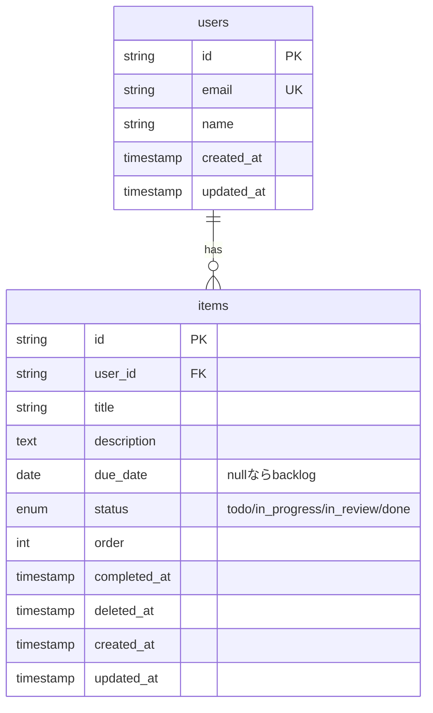

```mermaid
erDiagram
    users {
        string id PK
        string email UK
        string name
        timestamp created_at
        timestamp updated_at
    }

    items {
        string id PK
        string user_id FK
        string title
        text description
        date due_date "nullならbacklog"
        enum status "todo/in_progress/in_review/done"
        int order
        timestamp completed_at
        timestamp deleted_at
        timestamp created_at
        timestamp updated_at
    }

    users ||--o{ items : "has"
```